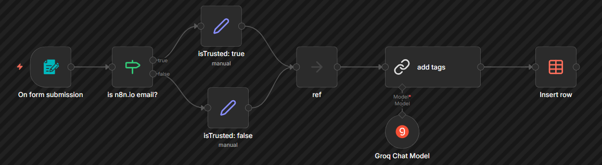
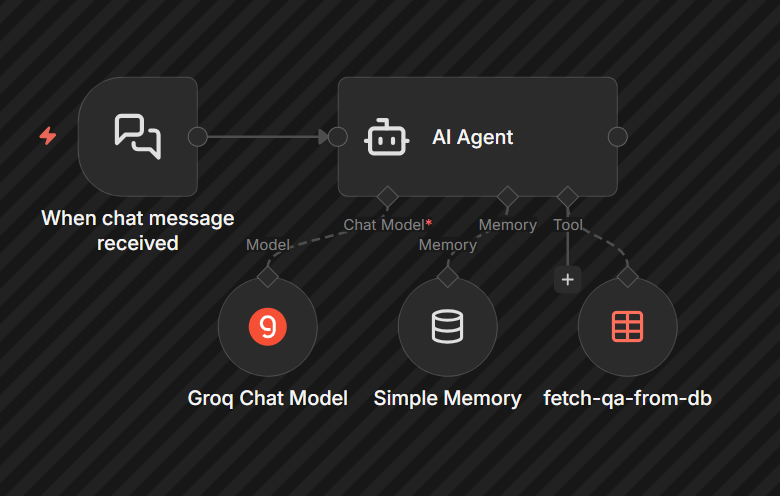

# AI-Powered Q&A Agent & Data Ingest Pipeline

This repository contains a fully functional Retrieval-Augmented Generation (RAG) system built using **n8n**, **Docker**, and **Groq**. The system is split into two interconnected micro-workflows: a backend data ingestion pipeline and a frontend conversational AI agent.

## System Architecture

### 1. The Knowledge Ingest Pipeline
This workflow acts as the backend data processor. It receives form submissions via webhooks, routes data based on conditional logic (verifying trusted email domains), and utilizes an LLM to automatically generate descriptive metadata tags. The structured data is then stored in an n8n Data Table.

### 2. The Conversational AI Agent
This workflow serves as the user-facing application. It features a stateful AI agent equipped with session memory and a custom database-search tool. When a user asks a question, the agent dynamically formulates search queries, retrieves relevant rows from the knowledge base, and synthesizes an accurate response. 

## Tech Stack
* **Orchestration:** n8n (Self-hosted via Docker)
* **LLM Inference:** Groq (`llama-3.1-8b-instant`)
* **Database:** Native n8n Data Tables

## How to Run Locally
1. Clone this repository.
2. Ensure you have Docker installed and run a local n8n instance.
3. Import the two `.json` workflow files into your n8n workspace.
4. Create an n8n Data Table named "QA" with the following columns: `Name`, `Email`, `Question`, `Answer`, `isTrusted` (boolean), and `Tags`.
5. Connect your Groq API credentials to the LLM nodes.
